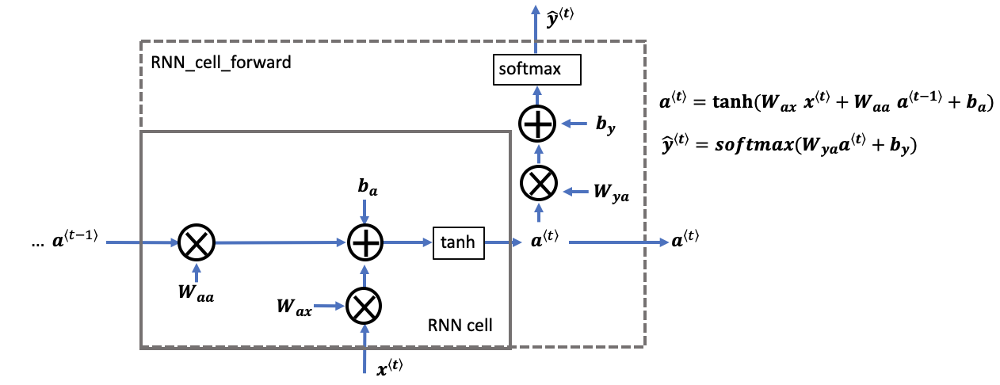

## Project Objective:
 
<ul>
    <li>Define notation for building sequence models</li>
    <li>Describe the architecture of a basic RNN</li>
    <li>Identify the main components of an LSTM</li>
    <li>Implement backpropagation through time for a basic RNN and an LSTM</li>
    <li>Give examples of several types of RNN</li>
</ul>
 
Recurrent Neural Networks (RNN) are very effective for Natural Language Processing and other sequence tasks because they have "memory." They can read inputs $x^{\langle t \rangle}$ (such as words) one at a time, and remember some contextual information through the hidden layer activations that get passed from one time step to the next. This allows a unidirectional (one-way) RNN to take information from the past to process later inputs. A bidirectional (two-way) RNN can take context from both the past and the future

## 1 - Forward Propagation for the Basic Recurrent Neural Network

 
In this example, $T_x = T_y$.

## RNN Cell

## RNN Forward Pass

## 2 - Long Short-Term Memory (LSTM) Network

### LSTM Cell

