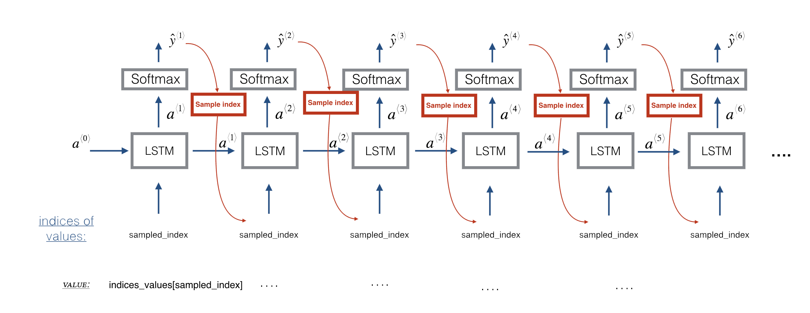

## Project Objectives:

<ul>
    <li>Apply an LSTM to a music generation task</li>
    <li>Generate your own jazz music with deep learning</li>
    <li>Use the flexible Functional API to create complex models</li>
</ul>

The music dataset for this project is already preprocessed and contains 90 unique values.
 
We have m training samples each of shape (30, 90), where 30 is max time step.
Hence, at each time step, the input is one of 90 different possible values, represented as a one-hot vector.

 

We are going to train a model that predicts the next note in a style similar to the jazz music it's trained on. The training is contained in the weights and biases of the model.

 

Then we are going to use those weights and biases in a new model that predicts a series of notes, and using the previous note to predict the next note.

 

We will use an LSTM with hidden states that have 64 dimmensions.

#### Sequence generation uses a for-loop:
<ul>
    <li>If we are building an RNN where, at test time, the entire input sequence is given then Keras has simple built-in functions to build the model.</li>
    <li>However, for sequence generation, at test time we won't know all the values of input sequence in advance.</li>
    <li>Instead we will generate them one at a time. The input at time 't' is the prediction at the previous time step 't-1'. Hence, we will need to implement our own for-loop to iterate over the time steps.</li>
</ul>

#### Shareable weights:

<ul>
    <li>We will call LSTM layer max input time step times using a for-loop.</li>
    <li>It is important that all input time step copies have the same weights.</li>
</ul>

