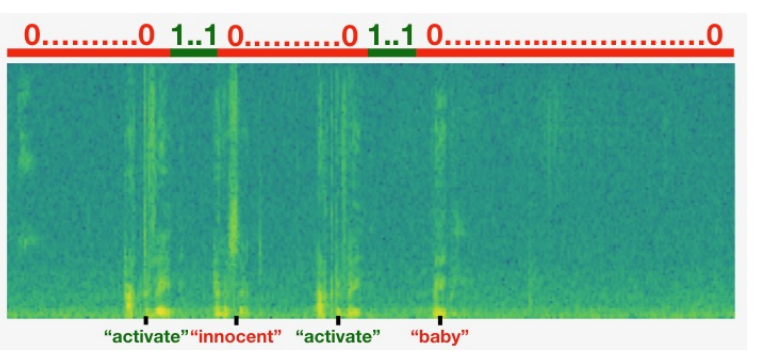
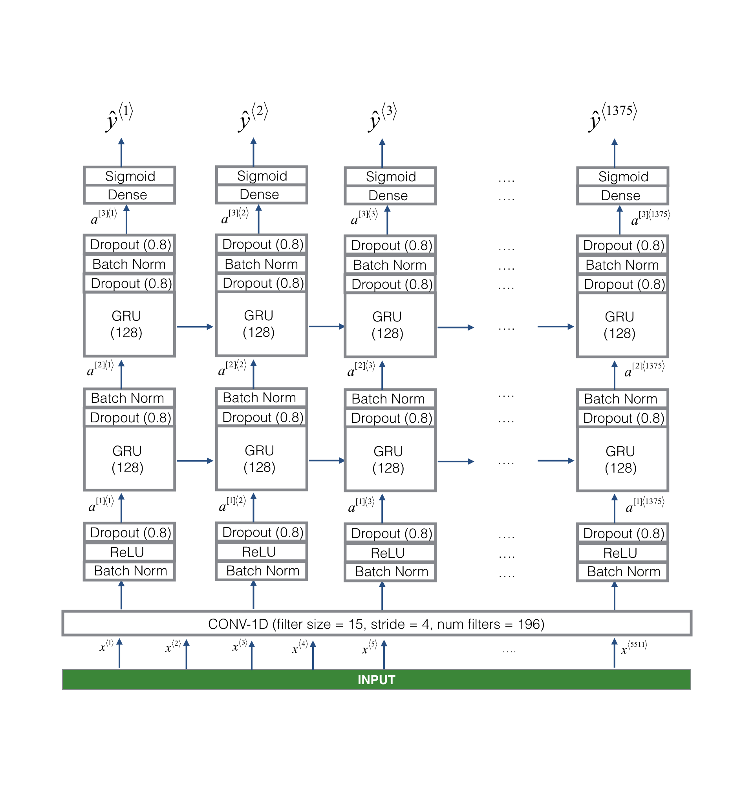

## Project Objectives:

<ul>
    <li>Structure a speech recognition project</li>
    <li>Synthesize and process audio recordings to create train/dev datasets</li>
    <li>Train a trigger word detection model and make predictions</li>
</ul>

### From Audio Recordings to Spectrograms:

What really is an audio recording?

<ul>
    <li>A microphone records little variations in air pressure over time, and it is these little variations in air pressure that our ear also perceives as sound.</li>
    <li>We can think of an audio recording as a long list of numbers measuring the little air pressure changes detected by the microphone.</li>
    <li>We will use audio sampled at 44100 Hz (or 44100 Hertz). This means the microphone gives us 44,100 numbers per second.</li>
    <li>Thus, a 10 second audio clip is represented by 441,000 numbers (= 10 x 44,100).</li>
    <li>In order to help our sequence model more easily learn to detect trigger words, we will compute a spectrogram of the audio.</li>
    <li>The spectrogram tells us how much different frequencies are present in an audio clip at any moment in time.</li>
    <li>A spectrogram is computed by sliding a window over the raw audio signal, and calculating the most active frequencies in each window using a Fourier transform.</li>

</ul>

### Dividing into time-intervals:

Note that we may divide a 10 second interval of time with different units (steps).

<ul>
    <li>Raw audio divides 10 seconds into 441,000 units.</li>
    <li>A spectrogram divides 10 seconds into 5,511 units. Tx=5511</li>
    <li>We will use a Python module pydub to synthesize audio, and it divides 10 seconds into 10,000 units.</li>
    <li>The output of our model will divide 10 seconds into 1,375 units. Ty=1375</li>
    <li>    For each of the 1375 time steps, the model predicts whether someone recently finished saying the trigger word "activate".</li>
    <li>All of these are hyperparameters and can be changed (except the 441000, which is a function of the microphone).</li>
    <li>We have chosen values that are within the standard range used for speech systems.</li>
</ul>

### Data Synthesis: Creating a Speech Dataset

<ul>
    <li>We have the raw audio files of the positive words ('activate'), negative words (other than word 'activate'), and background noise. We will use these audio files to synthesize a dataset to train the model.</li>
    <li>The "activate" directory contains positive examples of people saying the word "activate"</li>
    <li>The "negatives" directory contains negative examples of people saying random words other than "activate".</li>
    <li>There is one word per audio recording.</li>
    <li>The "backgrounds" directory contains 10 second clips of background noise in different environments.</li>
</ul>

We will use these three types of recordings (positives/negatives/backgrounds) to create a labeled dataset.

Because speech data is hard to acquire and label, we will synthesize our training data using the audio clips of activates, negatives, and backgrounds.

<ul>
    <li>It is quite slow to record lots of 10 second audio clips with random "activates" in it.</li>
    <li>Instead, it is easier to record lots of positives and negative words, and record background noise separately (or download background noise from free online sources).</li>
</ul>

#### Process for synthesizing an audio clip:

<ul>To synthesize a single training example, we will:
    <li>Pick a random 10 second background audio clip</li>
    <li>Randomly insert 0-4 audio clips of "activate" into this 10 sec. clip</li>
    <li>Randomly insert 0-2 audio clips of negative words into this 10 sec. clip</li>
</ul>

Because we had synthesized the word "activate" into the background clip, we know exactly when in the 10 second clip the "activate" makes its appearance.

### Label the positiev/negative words:

Recall that the labels represent whether or not someone has just finished saying "activate". Label is 1 when that clip has finished saying "activate". Given a background clip, we can initialize label=0 for time steps "t", since the clip doesn't contain any "activate".

 

When we insert or overlay an "activate" clip, we will also update labels for relative time steps. Rather than updating the label of a single time step, we will update 50 steps of the output to have target label 1. Where updating several consecutive time steps can make the training data more balanced.

 

We will train a GRU (Gated Recurrent Unit) to detect when someone has finished saying "activate".

#### Example:

<ul>
    <li>Suppose the synthesized "activate" clip ends at the 5 second mark in the 10 second audio - exactly halfway into the clip.</li>
    <li>Recall that Ty = 1375, so timestep 687 = int(1375*0.5) corresponds to the moment 5 seconds into the audio clip.</li>
    <li>We will allow the GRU to detect "activate" anywhere within a short time-internal after this moment, so we actually set 50 consecutive values of the label to 1.</li>
</ul>

#### Visualizing the labels:
We have inserted "activate", "innocent", "activate", "baby." Note that the positive labels "1" are associated only with the positive words.

### Development Set:

<ul>
    <li>While our training data is synthesized, we want to create a development set using the same distribution as the real inputs.</li>
    <li>Thus, we recorded 25 10-second audio clips of people saying "activate" and other random words, and labeled them by hand.</li>
    <li>This follows the principle that we should create the dev set to be as similar as possible to the test set distribution.</li>
</ul>

### The model:

The model will use 1-D convolutional layers, GRU layers, and dense layers.Our goal is to build a network that will ingest a spectrogram and output a signal when it detects the trigger word. This network will use 4 layers:
<ul>
    <li>A convolutional layer</li>
    <li>Two GRU layers</li>
    <li>A dense layer</li>
</ul>

Following is the architecture that we will use:

#### 1D Convolutional layer:

<ul>
    <li>It inputs the 5511 step spectrogram. Each step is a vector of 101 units.</li>
    <li>It outputs a 1375 step output(=(5511-15//4)+1).</li>
    <li>This output is further processed by multiple layers to get the final Ty = 1375 step output.</li>
    <li>Computationally, the 1-D conv layer also helps speed up the model because now the GRU can process only 1375 timesteps rather than 5511 timesteps.</li>
</ul>

#### GRU, dense and sigmoid:

<ul>
    <li>The two GRU layers read the sequence of inputs from left to right.</li>
    <li>A dense plus sigmoid layer makes a prediction.</li>
    <li>Because y is a binary value (0 or 1), we use a sigmoid output at the last layer to estimate the chance of the output being 1, corresponding to the user having just said "activate".</li>
</ul>

#### Unidirectional RNN:

<ul>
    <li>Note that we use a unidirectional RNN rather than a bidirectional RNN.</li>
    <li>This is really important for trigger word detection, since we want to be able to detect the trigger word almost immediately after it is said.</li>
    <li>If we used a bidirectional RNN, we would have to wait for the whole 10sec of audio to be recorded before we could tell if "activate" was said in the first second of the audio clip.</li>
</ul>

#### Insert a chime to acknowledge the "activate" trigger:
<ul>
    <li>Once we've estimated the probability of having detected the word "activate" at each output step, we can trigger a "chiming" sound to play when the probability is above a certain threshold.</li>
    <li>Output might be near 1 for many values in a row after "activate" is said, yet we want to chime only once. So we will insert a chime sound at most once every 75 output steps.</li>
    <li>This will help prevent us from inserting two chimes for a single instance of "activate". This plays a role similar to non-max suppression from computer vision.</li>
</ul>